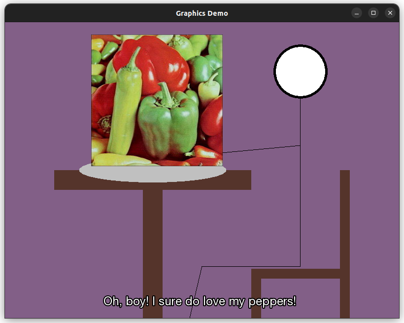

# 2d-graphics-demo
Assignment 2 - 2D Graphics Demo for CSCI 43700

## Installation

### Requirements

- [SFML](https://www.sfml-dev.org/)

### Building

To build, clone the directory and run `make` in the source directory. This will build an executable named `demo.out`.

## Running

After building, you may run the program using `./demo.out` or `make run`.

## What I Learned

This project was a great foray into learning SFML. I had only briefly tinkered with it before, so this was a great chance for me to learn about it.
More specifically, I had never attempted to render fonts or images onto a window, only basic shapes. This project was a great exercise in doing those things. I did not know that you could not render an `sf::Image` directly onto the screen - it has to be a sprite! Additionally, I tried to put focus into creating nice, documented, readable code, as well as a nice Makefile. I hope that you find I succeeded!

## Results

## Author

- Willow Ciesialka